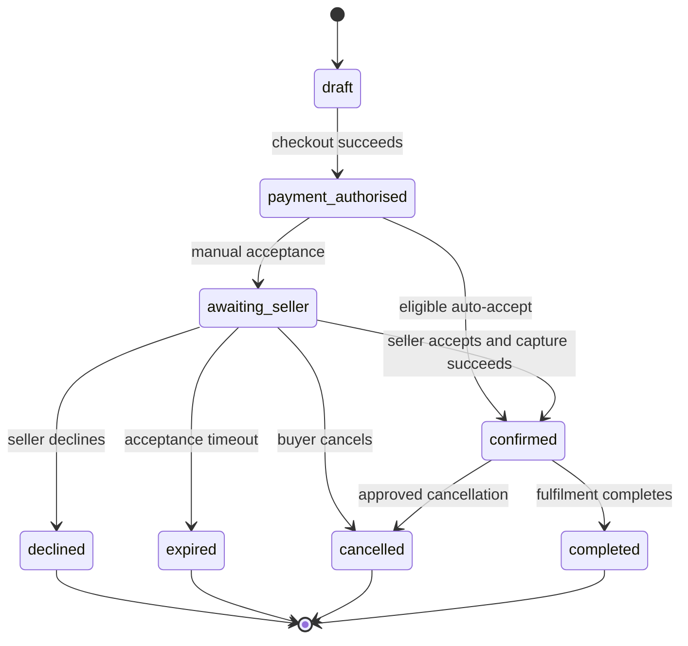
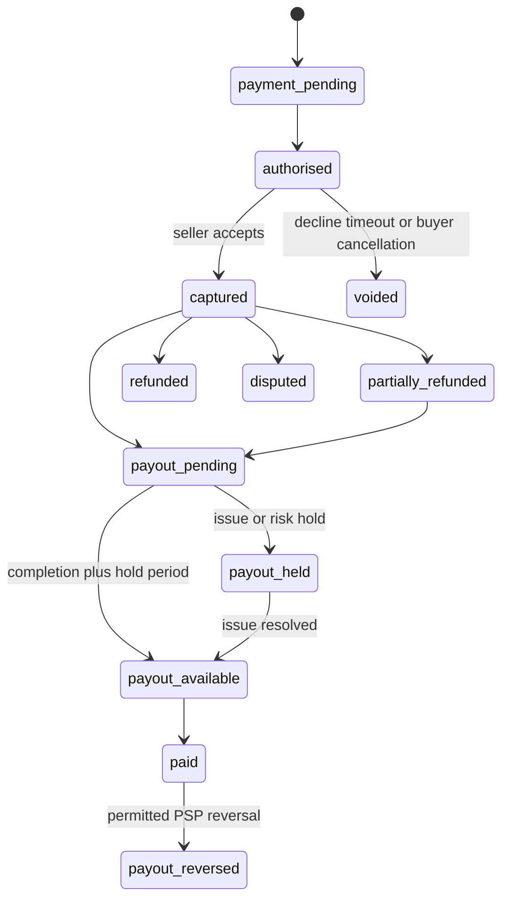
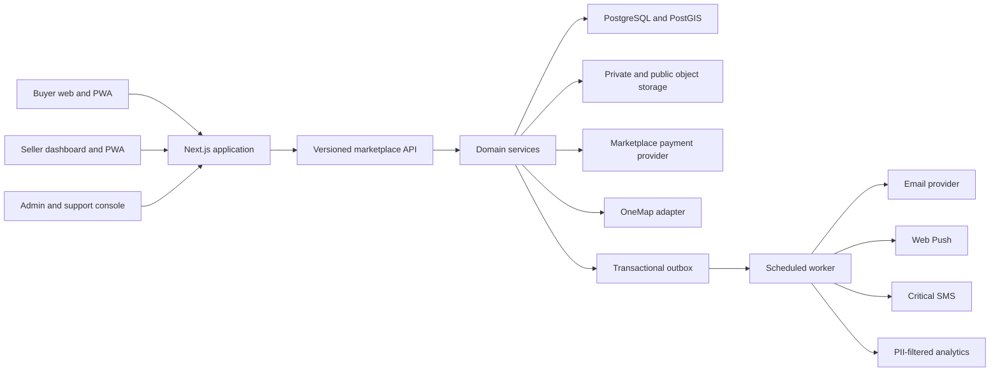

# Singapore Florist Platform MVP PRD

**Document purpose:** Build-ready product requirements, operating model, technical architecture, data model, delivery plan, and launch gates for the first Singapore florist marketplace MVP.

**Source concept:** [[Singapore Florist Platform Concept]]

**Working release:** Closed beta with 10–15 curated florists, followed by a measured 60–90 day pilot.

## 1. Executive decision

Build a curated, mobile-first marketplace for independent Singapore florists as a **responsive web application and installable PWA**, with three role-specific experiences:

1. Buyer marketplace
2. Seller operations dashboard
3. Platform admin and support console

Do not build native iOS or Android applications for the MVP. Build the backend and versioned API so that a native seller application can be added later without replacing marketplace logic.

The core product is not the catalogue. It is an **availability and fulfilment engine** that answers:

> Which products can genuinely be fulfilled by this seller, for this buyer's date, location, fulfilment method, time window, and budget?

### 1.1 Approved working assumptions

| ID      | Decision                  | MVP position                                                                                                                                                                                                                                |
| ------- | ------------------------- | ------------------------------------------------------------------------------------------------------------------------------------------------------------------------------------------------------------------------------------------- |
| DEC-001 | Marketplace role          | Florist is seller of record; platform acts as marketplace agent, subject to Singapore legal confirmation.                                                                                                                                   |
| DEC-002 | Payment movement          | Licensed marketplace PSP handles seller onboarding, payment acquisition, refunds, disputes, and payouts. Buyer funds do not enter the platform's ordinary bank account.                                                                     |
| DEC-003 | Fulfilment ownership      | Seller-managed delivery at launch. The platform does not book couriers or operate a fleet.                                                                                                                                                  |
| DEC-004 | Seller fulfilment options | Delivery-only, pickup-only, or both. Pickup is never inferred from seller type.                                                                                                                                                             |
| DEC-005 | Home-based sellers        | Home sellers default to delivery-only. Home pickup requires explicit seller opt-in, compliance attestation, and platform approval.                                                                                                          |
| DEC-006 | Cart model                | One seller per cart and order.                                                                                                                                                                                                              |
| DEC-007 | Seller acquisition        | Invite-only and manually reviewed. No open marketplace signup at launch.                                                                                                                                                                    |
| DEC-008 | Seller registration       | UEN required unless a legitimate exemption is reviewed and approved.                                                                                                                                                                        |
| DEC-009 | Product model             | Structured catalogue products first. Custom quote requests are secondary and must convert into an in-platform order.                                                                                                                        |
| DEC-010 | Support                   | Platform owns first-line buyer support and defined refund authority; seller remains responsible for product and seller-managed delivery performance.                                                                                        |
| DEC-011 | Revenue                   | Configurable commission, initial planning default 15% of item and add-on subtotal, excluding pass-through delivery.                                                                                                                         |
| DEC-012 | Geographic scope          | Singapore sellers, Singapore inventory, and Singapore fulfilment only. No import-at-order or overseas sellers in MVP.                                                                                                                       |
| DEC-013 | Launch payment methods    | Manual-acceptance checkout initially uses card/wallet methods that support authorisation and later capture. PayNow remains disabled until a compatible auto-accept or accept-then-pay flow is validated. No off-platform PayNow collection. |
| DEC-014 | Buyer access              | Allow low-friction guest checkout with verified email and secure magic-link order access; offer account creation without forcing a password before purchase.                                                                                |

### 1.2 Decisions requiring professional confirmation before payment implementation

- Marketplace agent versus principal wording
- Seller-of-record and invoice responsibilities
- PSP configuration and permitted payout timing
- Consumer cancellation, refund, and substitution terms
- GST treatment of seller sales, delivery charges, commission, and platform fees
- Recipient-data consent or applicable delivery exception
- Exact retention periods for addresses, messages, and dispute evidence

## 2. Product definition

### 2.1 Problem statement

Independent florists often sell through Instagram, WhatsApp, and manual payment links. Buyers struggle to determine:

- Which florists are available for a required date
- Whether a seller supports pickup, delivery, or both
- Whether the buyer's postcode is serviceable
- What delivery will actually cost
- Whether the seller can meet the requested time window
- How substitutions, delays, damage, and refunds will be handled

Sellers struggle with:

- Discovery and customer acquisition
- Repetitive availability questions
- Manual order capture and payment reconciliation
- Capacity management during peak dates
- Pickup and delivery coordination
- Buyer clarification and substitution approval
- Order deadlines and status communication

### 2.2 Product vision

> Discover and order from independent Singapore florists with real date, location, capacity, pickup, and delivery availability—without chasing sellers through direct messages.

### 2.3 MVP objective

Validate that a curated marketplace can generate incremental, economically sustainable florist orders while reducing fulfilment ambiguity for buyers and administrative work for sellers.

### 2.4 MVP non-goals

- Platform-operated courier network
- Courier booking or route optimisation
- Instant or exact-time delivery promise
- Multi-seller cart
- Native mobile applications
- Generic marketplace for every home-based business
- Complex inventory or production forecasting
- Open seller signup
- Seller subscription plans
- Loyalty points or wallet balances
- AI-generated product matching as a core dependency
- Full customer relationship management system

## 3. Users and jobs to be done

### 3.1 Buyer

**Primary job:** Find a suitable floral gift that is genuinely available for the required date and destination, understand the full price, order securely, and receive dependable fulfilment updates.

**Important contexts:**

- Surprise recipient
- Emotionally important occasion
- Time-sensitive delivery
- Unfamiliarity with flower types
- Need for style comparison rather than commodity comparison
- Concern about damage, substitutions, and lateness

### 3.2 Home-based florist

**Primary job:** Receive incremental orders without exposing a residential address, overbooking production capacity, or manually answering every availability and delivery question.

**Special needs:**

- Delivery-only mode
- Private production address
- Quick pause/resume
- Limited daily capacity
- Flexible lead times
- Seller-managed courier arrangement
- Mobile-first order actions

### 3.3 Studio or physical-store florist

**Primary job:** Use public location and pickup availability to attract nearby buyers while managing scheduled pickup, delivery, catalogue, capacity, and customer communication in one place.

### 3.4 Platform operations and support

**Primary job:** Approve trustworthy sellers, prevent invalid availability, intervene in fulfilment exceptions, issue authorised refunds, protect private information, and maintain a complete order and financial audit trail.

## 4. Product principles

1. **Availability before abundance:** Fewer accurate results are better than a large unavailable catalogue.
2. **Seller capability, not seller stereotype:** Home, studio, and store classifications do not automatically determine pickup or delivery.
3. **Privacy by architecture:** Private data must be excluded from unauthorised payloads, not merely hidden in the interface.
4. **Every order has a next action:** Active orders always identify the responsible party and deadline.
5. **Order history is immutable:** Listing edits never rewrite what a buyer purchased.
6. **Payment is a separate state machine:** A seller status button is never the source of truth for money movement.
7. **Manual operations are acceptable; invisible failure is not:** Admin intervention is valid during MVP if it is recorded and measurable.
8. **Mobile-first, not mobile-only:** Sellers need fast phone actions and useful desktop catalogue management.
9. **The platform earns retention through value:** Payment protection, order records, support, reminders, and seller tools reduce bypass more effectively than aggressive message censorship.

## 5. Roles and access

| Role              | MVP access                                                                                                    |
| ----------------- | ------------------------------------------------------------------------------------------------------------- |
| Anonymous visitor | Public seller and product pages; availability search; no private location data                                |
| Buyer             | Own cart, orders, messages, substitution responses, issue reports, reviews, and receipts                      |
| Seller owner      | Own seller profile, catalogue, availability, fulfilment configuration, orders, messages, and payout summaries |
| Support agent     | Assigned support cases, order evidence, permitted refunds, and limited address access when necessary          |
| Finance admin     | Payments, refunds, fees, payouts, reconciliation, and financial exports                                       |
| Risk/admin        | Seller verification, suspension, listing moderation, fraud notes, payout holds, and protected-data audit      |
| Super admin       | Configuration and emergency access; mandatory MFA and heightened audit requirements                           |

**MVP constraint:** One seller-owner login per seller is sufficient for beta. The data model should support seller memberships later without exposing multi-user management in the first release.

## 6. Fulfilment and location model

### 6.1 Supported seller configurations

| Configuration               | Buyer sees before order                                           | Exact address visibility                         | Search behaviour                                       |
| --------------------------- | ----------------------------------------------------------------- | ------------------------------------------------ | ------------------------------------------------------ |
| Home, delivery-only         | General service area and delivery availability                    | Never shown to buyer                             | Filter by destination serviceability and fee           |
| Home, pickup enabled        | Neighbourhood and broad distance band                             | After seller acceptance and payment confirmation | Filter by real pickup slot; sort privately by distance |
| Public studio/store pickup  | Public address, map location, and pickup hours                    | Public                                           | Filter and sort by available slot and distance         |
| Public store, delivery-only | Public brand location may be displayed; pickup marked unavailable | Public business address only                     | Filter by destination serviceability and fee           |

### 6.2 Address types

- `registered`: Legal or KYC address; never used automatically as a pickup point.
- `production`: Where the arrangement is prepared or collected by a seller's courier.
- `pickup`: Where a buyer is instructed to collect.
- `public_store`: Public storefront address.
- `return`: Address for an exceptional return, if applicable.
- `public_search_area`: Non-exact neighbourhood, postal sector, or approved area centroid.

### 6.3 Location privacy requirements

- Exact home addresses, unit numbers, and coordinates must be encrypted at rest.
- Anonymous and pre-order APIs must never return exact private-home address data.
- Private coordinates must not appear in page HTML, source maps, analytics, logs, exports, image metadata, or map payloads.
- Distance to a home pickup point is calculated server-side.
- Public results show an approved neighbourhood or broad distance band, not an exact home pin.
- Exact private pickup instructions are released only to the buyer on an accepted, paid pickup order.
- A delivery-only home origin is never buyer-visible.
- Device geolocation is optional, one-time, and user-initiated. Typed postal code must always work.

### 6.4 Delivery serviceability

MVP sellers configure delivery using one of:

- Supported postal sectors with a flat fee per zone
- Supported named zones with a flat fee per zone
- Islandwide delivery with defined excluded or surcharge areas

Do not implement route-based pricing or live courier quotations in MVP.

## 7. Availability and capacity engine

### 7.1 Availability dimensions

Do not use a single `open` boolean. The availability service evaluates:

1. Seller approval and suspension state
2. Seller accepting-new-orders state
3. Product published/paused/archived state
4. Fulfilment method enabled for seller and product
5. Requested date and window
6. Seller response hours
7. Minimum lead time and cutoff
8. Blackout dates and exceptions
9. Daily and slot capacity
10. Product stock where explicitly limited
11. Destination serviceability for delivery
12. Pickup-point availability for pickup

### 7.2 Bookability invariant

```text
bookable =
  seller_is_approved
  AND seller_accepts_new_orders
  AND product_is_published
  AND requested_method_is_enabled
  AND requested_date_is_allowed
  AND lead_time_and_cutoff_pass
  AND date_is_not_blocked
  AND capacity_is_available
  AND (
    pickup_slot_is_available
    OR delivery_destination_is_serviceable
  )
```

Search, product pages, cart validation, and checkout must call the same availability service. Checkout always revalidates immediately before payment.

### 7.3 Seller controls

- Recurring response hours
- Pickup windows
- Delivery windows
- Minimum lead time
- Same-day cutoff
- Default daily order cap
- Per-date capacity override
- Per-slot capacity override
- Blackout date or date range
- Pause new orders until a selected date/time
- Pause indefinitely
- Disable a fulfilment method temporarily
- Pause an individual product

Pausing or reducing availability affects new intake only. Confirmed orders remain obligations.

### 7.4 Capacity reservations

- Default checkout hold: 15 minutes
- Checkout capacity states: `available → checkout_hold → pending_seller_acceptance → committed`, with release/expiry exits.
- Holds are created atomically in the database.
- The 15-minute checkout hold protects capacity only while the buyer completes checkout.
- Successful payment authorisation and order submission convert the checkout hold into a pending-seller-acceptance reservation that remains valid until `accept_by`.
- Payment failure or abandoned checkout releases the checkout hold.
- Buyer cancellation, seller decline, and acceptance timeout release the pending-acceptance reservation.
- Seller acceptance converts the pending-acceptance reservation to committed capacity.
- Two simultaneous buyers cannot both obtain the last capacity unit.

## 8. Buyer journey

### 8.1 Discovery

1. Buyer enters date, fulfilment method, and postcode/area.
2. Buyer may refine by occasion, budget, style, flower type, seller, and time window.
3. Results include only currently bookable products for the selected context.
4. Pickup results show available pickup area/window and public-store distance or private-home distance band.
5. Delivery results show serviceability, seller-arranged fee, and delivery window.
6. Empty results explain why and offer the next available date, other fulfilment method, nearby area, or adjusted budget.

### 8.2 Product selection

The product page must show:

- Seller identity and verification status
- Product title, description, dimensions or approximate stem count
- Representative-photo disclosure
- Included items
- Variants and add-ons
- Structured personalisation fields
- Available fulfilment methods and windows
- Lead time and confirmation expectation
- Delivery fee or pickup area
- Cancellation, freshness, damage, and substitution policies
- Final seller responsibility statement for seller-managed delivery

### 8.3 Cart and checkout

- One seller per cart.
- Adding a product from another seller asks the buyer to start a separate cart.
- Cart revalidates price, product state, capacity, date, method, and destination.
- Checkout stores buyer and recipient as separate records.
- Paid add-ons are never preselected.
- Buyer selects a substitution preference.
- Buyer sees goods, add-ons, discount, delivery, platform fee if any, applicable tax treatment, and final total before payment.
- Buyer confirms authority to provide recipient details for fulfilment.

### 8.4 Confirmation and tracking

- Manual-acceptance orders display `Awaiting seller confirmation` and `confirm_by`.
- Seller acceptance triggers payment capture and order confirmation.
- Decline, timeout, or buyer cancellation before capture voids the payment authorisation.
- Buyer tracking shows a simplified projection of the detailed operational states.
- Buyer can message the seller and support within the order.
- Exact private pickup instructions are revealed only after confirmation.

### 8.5 Completion and aftercare

- Pickup requires an order-specific code or equivalent confirmation.
- Delivery records seller/courier reference, timestamps, and proof where used.
- Buyer can report late, damaged, wilted, incorrect, materially substituted, or missing fulfilment.
- Buyer can submit a verified-purchase review after completion.
- Buyer can download the order receipt and evidence summary.

## 9. Seller onboarding journey

### 9.1 Seller lifecycle

```text
draft
  → submitted
  → under_review
      → needs_information → resubmitted → under_review
      → approved_inactive
      → rejected
approved_inactive → active
active ↔ paused
active/paused → restricted/suspended/closed
```

Approval and marketplace availability are separate. Approval does not publish an incomplete storefront.

### 9.2 Onboarding steps

1. Account creation and verified email/phone
2. Legal entity, UEN, trading name, and authorised representative
3. PSP connected-account onboarding and verification
4. Seller type and public brand profile
5. Address creation with explicit type and privacy classification
6. Premises, customer-visit, HDB/URA/tenancy/MCST compliance attestation where relevant
7. Delivery-only, pickup-only, or both selection
8. Pickup location/privacy/windows where enabled
9. Delivery zones/fees/windows/cutoffs where enabled
10. Response hours, lead time, capacity, and blackout dates
11. Cancellation, substitution, freshness, damage, no-show, and failed-delivery policies
12. First products, variants, add-ons, images, and pricing
13. Storefront preview and test order
14. Admin review and activation

### 9.3 Re-verification triggers

- Legal name or UEN change
- Authorised representative change
- Ownership change
- PSP restriction or verification expiry
- Annual ACRA live-status recheck
- Payout account change
- Protected production or pickup address change
- Repeated fraud, cancellation, delivery, or consumer complaints

## 10. Seller daily operations

### 10.1 Seller home screen

The dashboard is an action queue, not merely an order table.

Required queues:

- New requests, sorted by `accept_by`
- Waiting on seller
- Waiting on buyer
- Due today, ordered by next deadline
- Ready for pickup
- Ready for courier
- In transit
- Exceptions and overdue
- Upcoming capacity
- Unread messages
- Payout summary

### 10.2 Order detail

Each seller order view shows:

- Next action, owner, and deadline
- Fulfilment branch and selected window
- Purchased product/variant/add-on snapshot
- Buyer and recipient as separate parties
- Card message and fulfilment instructions as separate fields
- Substitution preference and pending requests
- Delivery address only when authorised
- Payment, refund, commission, and payout summary
- Conversation and system timeline
- Fulfilment proof and exception history

### 10.3 Seller actions

- Accept or decline with reason
- Mark preparation started
- Ask buyer for clarification
- Submit structured substitution request
- Mark ready for pickup
- Mark ready for courier
- Enter seller-managed courier/reference details
- Mark in transit and delivered
- Verify pickup collection
- Report failed delivery, no-show, delay, or inability to fulfil
- Request order cancellation
- Contact platform support

### 10.4 Seller catalogue and settings CRUD

Sellers can create, view, update, pause, archive, and restore:

- Profile content
- Products
- Variants
- Add-ons
- Images
- Prices
- Fulfilment method overrides
- Service zones and delivery fees
- Pickup/delivery windows
- Lead times and cutoffs
- Capacity and blackout dates
- Policies and pickup instructions

Historical order snapshots are immutable. Sellers cannot hard-delete orders, payments, messages, fulfilment evidence, or catalogue records referenced by an order.

## 11. Admin and support experience

### 11.1 Seller operations

- Review seller identity, UEN, PSP status, fulfilment setup, and attestations
- Request additional information
- Approve, activate, pause, restrict, suspend, reject, or close seller
- Review material identity/address changes
- Moderate and hide listings
- Stop new intake by seller, date, product, or fulfilment method
- Preserve handling plans for already confirmed orders

### 11.2 Exception queues

- Acceptance timeout
- Payment capture failure
- Seller cancellation
- Buyer cancellation requiring review
- Preparation deadline at risk or overdue
- Unresolved substitution
- Pickup no-show
- Failed or late delivery
- Damage, freshness, wrong-item, or missing-order complaint
- Refund or partial refund
- Chargeback/dispute
- Payout hold or reversal
- Suspicious seller or buyer activity

### 11.3 Unified order timeline

Admin sees an append-only timeline containing:

- Order state changes
- Actor and role
- Availability/capacity events
- Messages and attachments
- Substitution decisions
- Payment webhooks
- Refunds and payouts
- Fulfilment proof
- Support actions
- Protected-address access
- Admin overrides

### 11.4 Financial controls

- Issue authorised full or partial refund
- Record refund reason and allocation
- Hold or release seller payout through the PSP-supported flow
- Reconcile charge, commission, PSP fee, refund, and seller payout
- Export financial ledger without unnecessary recipient data

## 12. Functional requirements

Priority definitions: **P0** required for closed beta; **P1** required before wider public launch; **P2** post-MVP.

### 12.1 Core marketplace

| ID | Pri | Requirement | Acceptance summary |
|---|---:|---|---|
| FR-C01 | P0 | Seller configures delivery-only, pickup-only, or both. | Delivery-only sellers never appear in pickup search and cannot be checked out as pickup. |
| FR-C02 | P0 | One shared availability service powers search, product, cart, and checkout. | The same context returns the same eligibility result at every surface. |
| FR-C03 | P0 | Checkout creates an atomic 15-minute hold and converts it to a pending-acceptance reservation on order submission. | Exactly one buyer obtains the final slot; capacity stays reserved through `accept_by` and releases on decline/timeout. |
| FR-C04 | P0 | One seller per cart/order. | Cross-seller add starts or prompts a separate cart. |
| FR-C05 | P0 | Order stores immutable commercial and policy snapshot. | Listing changes never change active or historical orders. |
| FR-C06 | P0 | All deadlines render in Asia/Singapore. | API, dashboard, buyer view, and notifications agree. |
| FR-C07 | P0 | All state-changing requests are idempotent. | Retries do not duplicate captures, refunds, payouts, or events. |

### 12.2 Location and fulfilment

| ID | Pri | Requirement | Acceptance summary |
|---|---:|---|---|
| FR-L01 | P0 | Store registered, production, pickup, public-store, and search-area addresses separately. | No workflow substitutes one address type for another. |
| FR-L02 | P0 | Protect exact home pickup address before confirmation. | Exact address and coordinates are absent from all unauthorised responses and telemetry. |
| FR-L03 | P0 | Delivery-only home origin is never buyer-visible. | Buyer cannot retrieve it at any order stage. |
| FR-L04 | P0 | Public store may publish exact address and pickup hours. | Public map/list reflects seller-approved store data. |
| FR-L05 | P0 | Delivery postcode validates against zones and fees. | Unsupported postcode cannot reach payment. |
| FR-L06 | P0 | Pickup filter means a real bookable slot exists. | Enabled-but-full sellers do not appear as available pickup. |

### 12.3 Buyer

| ID | Pri | Requirement | Acceptance summary |
|---|---:|---|---|
| FR-B01 | P0 | Search by date, method, postcode/area, occasion, style, and budget. | Results honour mandatory context and optional filters. |
| FR-B02 | P0 | Product page displays full fulfilment and policy context. | Buyer sees fee, window, lead time, confirmation expectation, cancellation, and substitution before cart. |
| FR-B03 | P0 | Checkout separates buyer and recipient. | Recipient data is collected only when required for fulfilment. |
| FR-B04 | P0 | Manual acceptance supports authorise, capture, decline, and timeout. | Confirmed implies successful capture; declined/expired implies no capture. |
| FR-B05 | P0 | Buyer sees simplified status and next expected event. | Every active order has an understandable next step/window. |
| FR-B06 | P0 | Buyer uses order-scoped messaging. | Buyer, seller, support, and system identities are distinct. |
| FR-B07 | P0 | Buyer approves/declines structured substitution. | Stale or expired responses cannot change the order. |
| FR-B08 | P0 | Buyer requests cancellation or reports issue with evidence. | Case enters appropriate support and financial workflow. |
| FR-B09 | P1 | Buyer completes pickup using order code. | Pickup cannot complete without verification or authorised override. |
| FR-B10 | P1 | Buyer receives verified-purchase review prompt. | Only completed buyers may review that order/seller. |
| FR-B11 | P0 | Buyer may complete guest checkout with verified secure order access. | Order number alone never grants access; magic-link/session is scoped to that buyer and order. |

### 12.4 Seller

| ID | Pri | Requirement | Acceptance summary |
|---|---:|---|---|
| FR-S01 | P0 | Guided onboarding and admin approval lifecycle. | Seller cannot accept orders before approval, PSP readiness, and storefront activation. |
| FR-S02 | P0 | Seller configures fulfilment, privacy, zones, fees, and windows. | Checkout only presents valid seller configuration. |
| FR-S03 | P0 | Seller configures response hours, lead time, capacity, blackouts, and pause. | Availability recalculates immediately and consistently. |
| FR-S04 | P0 | Pause blocks new orders only. | Confirmed obligations remain visible/actionable. |
| FR-S05 | P0 | Catalogue CRUD uses pause/archive, not destructive deletion. | Referenced records remain available to order history. |
| FR-S06 | P0 | Seller action dashboard sorts by next deadline. | Urgent work appears before later work regardless of creation time. |
| FR-S07 | P0 | Seller accepts/declines with reason and deadline. | Late acceptance is blocked or routed to recovery. |
| FR-S08 | P0 | Pickup and delivery have separate status branches. | Invalid cross-branch statuses are rejected. |
| FR-S09 | P0 | Seller proposes substitution rather than editing order. | Buyer decision and resulting refund are auditable. |
| FR-S10 | P0 | Seller sees transparent payout breakdown. | Gross, commission, PSP fee, refunds, hold, and net reconcile. |

### 12.5 Admin, support, and finance

| ID | Pri | Requirement | Acceptance summary |
|---|---:|---|---|
| FR-A01 | P0 | Admin reviews and controls seller lifecycle. | Every decision records actor, reason, and timestamp. |
| FR-A02 | P0 | Admin moderates listings without rewriting order snapshots. | Active/historical orders remain unchanged. |
| FR-A03 | P0 | Admin exception queues cover commercial, fulfilment, and financial failures. | Every defined exception has an owner and resolution path. |
| FR-A04 | P0 | Unified append-only order timeline. | All material actions and webhooks can be reconstructed. |
| FR-A05 | P0 | Support joins order thread under labelled identity. | No silent impersonation of buyer or seller. |
| FR-A06 | P0 | Authorised admin issues full/partial refunds and payout holds. | PSP and internal ledger reconcile. |
| FR-A07 | P0 | Protected data access is role-limited and audited. | Every exact private-address view creates an audit event. |
| FR-A08 | P1 | Buyer can download order evidence summary. | Summary contains order snapshot and resolution trail without unrelated PII. |

### 12.6 Privacy, payments, and compliance

| ID | Pri | Requirement | Acceptance summary |
|---|---:|---|---|
| FR-P01 | P0 | Buyer and recipient are separate protected entities. | Recipient data is never automatically added to marketing, analytics profiles, reviews, or seller CRM/export. |
| FR-P02 | P0 | Gift message is stored separately from courier instructions. | Courier-facing payload and proof never contain the gift message or occasion. |
| FR-P03 | P0 | Seller must complete PSP connected-account verification before accepting orders. | Platform stores provider status/reference, not raw NRIC images or numbers. |
| FR-P04 | P0 | Buyer funds move only through the approved marketplace PSP. | No platform wallet, ordinary-bank-account collection, manual seller transfer, or platform-operated escrow. |
| FR-P05 | P0 | Money-changing webhooks and commands are signed/verified, idempotent, and reconciled. | Duplicate callbacks create no duplicate financial effect. |
| FR-P06 | P0 | Seller GST status and effective dates are snapshotted per order. | GST is not added to non-GST seller goods; historical tax treatment never changes retroactively. |
| FR-P07 | P0 | Public prices and checkout totals are transparent. | GST-registered prices are GST-inclusive, paid add-ons are opt-in, and final total appears before payment. |
| FR-P08 | P1 | Invoice/receipt identifies the actual seller of record. | Non-GST seller document does not claim to be a tax invoice; corrections use credit-note/replacement workflow. |
| FR-P09 | P0 | Every protected-address view and privileged admin action is audited. | Access requires role and reason; event omits the address value itself. |
| FR-P10 | P0 | Incident workflow supports DPO assessment and notification deadlines. | Assessment time is recorded and DPO is alerted to the three-calendar-day PDPC deadline where a breach is notifiable. |

## 13. State machines and invariants

State axes remain separate. The buyer receives a simplified projection; seller/admin retain operational detail.

### 13.1 Commercial order



### 13.2 Payment and payout



### 13.3 Production

```text
not_started → preparing → ready
                  ↕
          waiting_on_buyer
```

Readiness is blocked while a required buyer clarification or material substitution remains unresolved, unless checkout recorded a valid pre-approved fallback.

### 13.4 Pickup

```text
scheduled → ready_for_pickup → collected → completed
                                ↘ no_show → rescheduled / support_case
```

### 13.5 Delivery

```text
scheduled → ready_for_courier → in_transit → delivered → completed
                                      ↘ delivery_failed → reattempt / support_case
```

### 13.6 Substitution

```text
none → requested → approved → applied
                 ↘ declined
                 ↘ expired → fallback_applied / seller_cancellation
```

### 13.7 Support case

```text
open → waiting_on_buyer / waiting_on_seller / under_review
     → resolved → closed
```

### 13.8 Required invariants

- `order.commercial_status = confirmed` requires a successful captured payment reference.
- Declined, expired, and pre-capture cancelled orders have no committed capacity and no captured payment.
- A capacity unit can be held or committed to only one live order.
- A checkout hold expires after 15 minutes unless converted to a pending-acceptance reservation by successful order submission.
- A pending-acceptance reservation remains allocated through `accept_by` and is released on decline, cancellation, or timeout.
- Pickup statuses cannot be applied to delivery orders and vice versa.
- A pickup order cannot complete before collection verification or authorised admin override.
- A delivery order cannot complete while delivery is failed or an associated blocking issue is open.
- A required material substitution blocks readiness until resolved.
- Seller payout cannot become available before completion, the payout hold period, and resolution of blocking cases.
- Refund or cancellation never erases prior production, payment, message, or fulfilment history.
- Paused or suspended sellers receive no new orders; confirmed orders remain in a defined fulfil-or-support workflow.
- Listing/profile changes do not mutate any order snapshot.

## 14. Initial operating policies

These values are configurable and must be reviewed after the closed beta.

| Policy | MVP default |
|---|---|
| Checkout capacity hold | 15 minutes |
| Seller acceptance SLA | 60 minutes counted only during configured response hours |
| Acceptance reminder | At 15 and 45 minutes of elapsed response time |
| Acceptance timeout | At 60 elapsed response minutes; void authorisation and release capacity |
| Same-day orders | Only products/sellers explicitly configured for same-day; default manual acceptance |
| Buyer cancellation before capture | Immediate and free; void authorisation |
| Buyer cancellation after capture | Policy-driven request; no automatic promise once preparation begins |
| Material substitution | Explicit buyer approval required unless a clearly bounded fallback was selected at checkout |
| Higher-price substitution | Not supported in MVP; create a new order or support-assisted replacement |
| Lower-value substitution | Allowed after approval; partial refund required |
| Pickup grace period | 30 minutes, followed by seller message and no-show workflow |
| Damage/wilt/wrong-item reporting target | Within 24 hours of delivery/pickup; statutory rights are not limited by this operational target |
| Complaint acknowledgement | Within one business day |
| Initial complaint resolution target | Within three business days |
| Seller payout hold | Planning default 48 hours after completion; extend while a blocking case/dispute is open |
| Commission | Configurable; planning default 15% of item and add-on subtotal, excluding delivery |
| Home pickup | Disabled by default; explicit compliance attestation and admin approval required |
| Marketing consent | Separate, optional, and unchecked by default |
| Transaction notifications | Mandatory email; in-app always; web push optional; critical seller SMS configurable |

### 14.1 Failed-delivery allocation

- Buyer-provided invalid address, unreachable recipient, or refused delivery: buyer may be charged a disclosed redelivery fee.
- Seller or seller-courier fault: seller must reattempt, replace, partially refund, or fully refund according to the case.
- Platform support may issue an authorised remedy and adjust/hold seller payout under the seller agreement.
- Every failed-delivery decision records reason, evidence, responsible party, cost allocation, and next action.

### 14.2 Seller cancellation

A seller cannot silently cancel a confirmed order. Cancellation requires:

1. Reason code and explanation
2. Admin exception record
3. Buyer notification
4. Payment refund or replacement workflow
5. Capacity release where relevant
6. Payout cancellation/reversal
7. Seller reliability metric update

## 15. Data model

### 15.1 Data conventions

- Primary keys: UUID
- Money: integer minor units plus ISO currency (`SGD` in MVP)
- Canonical timestamps: UTC with explicit local rendering in `Asia/Singapore`
- Soft deletion: `archived_at`; no destructive deletion for referenced commercial records
- Optimistic concurrency: `version` or `updated_at` checks on seller-editable configuration
- Order snapshots: JSON plus structured monetary fields, immutable after submission except through explicit change/refund records
- Idempotency: unique idempotency key on money-changing and state-changing commands
- Auditing: append-only `audit_events` and `order_events`
- Private addresses and recipient fields: encrypted columns or application-level encrypted payload with key rotation plan

### 15.2 Entity relationship overview

```mermaid
erDiagram
    USERS ||--o| BUYER_PROFILES : has
    USERS ||--o{ SELLER_MEMBERSHIPS : joins
    SELLERS ||--o{ SELLER_MEMBERSHIPS : has
    SELLERS ||--o{ SELLER_LOCATIONS : owns
    SELLERS ||--o{ PRODUCTS : lists
    PRODUCTS ||--o{ PRODUCT_VARIANTS : has
    PRODUCTS ||--o{ PRODUCT_ADDONS : offers
    PRODUCTS ||--o{ PRODUCT_IMAGES : has
    SELLERS ||--o{ AVAILABILITY_RULES : configures
    SELLERS ||--o{ AVAILABILITY_EXCEPTIONS : configures
    SELLERS ||--o{ CAPACITY_SLOTS : owns
    SELLERS ||--o{ DELIVERY_ZONES : serves
    USERS ||--o{ CARTS : creates
    CARTS ||--o{ CART_ITEMS : contains
    CAPACITY_SLOTS ||--o{ CAPACITY_HOLDS : reserves
    USERS ||--o{ ORDERS : places
    SELLERS ||--o{ ORDERS : fulfils
    ORDERS ||--|{ ORDER_ITEMS : contains
    ORDERS ||--o| ORDER_RECIPIENTS : has
    ORDERS ||--o| ORDER_GIFT_MESSAGES : has
    ORDERS ||--|| ORDER_FULFILMENTS : has
    ORDERS ||--o{ ORDER_EVENTS : records
    ORDERS ||--o{ PAYMENT_RECORDS : has
    PAYMENT_RECORDS ||--o{ REFUNDS : has
    SELLERS ||--o{ PAYOUTS : receives
    ORDERS ||--|| CONVERSATIONS : has
    CONVERSATIONS ||--o{ MESSAGES : contains
    ORDERS ||--o{ SUBSTITUTION_REQUESTS : has
    ORDERS ||--o{ SUPPORT_CASES : has
    ORDERS ||--o| REVIEWS : receives
```



### 15.3 Identity and seller entities

#### `users`

| Field | Notes |
|---|---|
| `id` | UUID; linked to authentication provider |
| `email`, `phone` | Verified status stored separately; private |
| `role_flags` | Buyer, seller member, support, finance, risk, admin |
| `status` | Active, restricted, suspended, closed |
| `last_login_at` | Security/audit use |
| `created_at`, `updated_at` | Standard timestamps |

#### `buyer_profiles`

| Field | Notes |
|---|---|
| `user_id` | Owner |
| `display_name` | Buyer-facing name |
| `marketing_consent`, `marketing_consent_at` | Separate from transactional notices |
| `default_area` | Optional coarse area only |

Guest buyers use a verified email identity/session and may have no durable buyer profile until they choose to create one. Order access tokens are short-lived, single-purpose, revocable, and never replace normal authorisation checks.

#### `sellers`

| Field | Notes |
|---|---|
| `id` | UUID |
| `legal_name`, `trading_name`, `uen` | UEN unique where present |
| `entity_type` | Company, sole proprietor, partnership, reviewed exemption |
| `seller_status` | Draft, submitted, under review, needs info, approved inactive, active, paused, restricted, suspended, rejected, closed |
| `verification_status` | Pending, manual review, verified, restricted, expired |
| `psp_account_id`, `psp_ready` | Store provider reference/status, not raw KYC documents |
| `gst_registered`, `gst_number` | Include effective date range and evidence reference |
| `commission_bps` | Configurable basis points |
| `accepting_new_orders` | Operational toggle independent of approval |
| `paused_until` | Optional automatic resume |
| `public_story`, `logo_asset_id`, `style_tags` | Storefront fields |
| `rating_summary` | Derived, verified-order reviews only |

#### `seller_memberships`

Future-ready membership table with `seller_id`, `user_id`, `role`, `status`, and invitation timestamps. Expose owner-only membership in MVP.

#### `seller_verifications`

Stores verification type, provider/reference, status, review reason, reviewer, review timestamps, and expiry. Do not store NRIC number or images in MVP.

### 15.4 Location and fulfilment configuration

#### `seller_locations`

| Field | Notes |
|---|---|
| `seller_id` | Owner |
| `location_type` | Registered, production, pickup, public store, return, public search area |
| `premises_type` | Home, studio, commercial store, public meeting point |
| `visibility` | Private, order-only, public |
| `address_encrypted` | Exact address payload where required |
| `postal_code_hash/index` | Server-side lookup support without public disclosure |
| `exact_geography` | Restricted PostGIS point |
| `public_area_name`, `public_area_geography` | Approved non-exact representation |
| `customer_visits_permitted` | Seller attestation |
| `compliance_attested_at`, `approved_at` | Audit fields |

#### `fulfilment_methods`

- `seller_id`
- `method`: pickup or seller_delivery
- `enabled`
- `location_id`
- `minimum_order_minor`
- `lead_time_minutes`
- `same_day_cutoff_local`
- `instructions_template`

#### `delivery_zones`

- Seller and fulfilment method
- Zone name and supported postal sectors
- Fee in minor units
- Excluded/surcharge sectors
- Active date range
- Priority/order for matching

#### `availability_rules`

Recurring response hours, pickup windows, and delivery windows by local weekday. Store rule type separately so response hours are never confused with pickup hours.

#### `availability_exceptions`

Date or date-range exception with type: closed, capacity override, method disabled, changed window, or peak-date rule.

#### `capacity_slots`

- Seller, local date, optional fulfilment method/window
- Total capacity
- Held capacity
- Committed capacity
- Version/locking fields

#### `capacity_holds`

- Cart/order draft reference
- Capacity slot
- Quantity
- Status: checkout hold, pending seller acceptance, committed, released, expired
- Expires at
- Unique constraint preventing duplicate live hold for the same cart/slot

### 15.5 Catalogue

#### `products`

- Seller
- Title, slug, description
- Status: draft, published, paused, archived
- Occasion/style/flower tags
- Representative-photo disclosure
- Dimensions/stem guidance
- Base price minor units
- Default lead time
- Fulfilment method overrides
- Cancellation/substitution/freshness policy references
- Published/archived timestamps

#### `product_variants`

Size/format variants with title, structured option values, price delta, capacity quantity if limited, and active state.

#### `product_addons`

Optional, never preselected; title, price, image, stock/capacity constraints, and active state.

#### `product_images`

Private upload source plus public transformed asset, alt text, ordering, moderation status, and metadata-stripping status.

### 15.6 Cart and order

#### `carts` and `cart_items`

- One active seller per cart
- Selected product, variant, add-ons, quantity
- Requested date, method, window, postcode context
- Last validation result/version
- Expiration timestamp

#### `orders`

| Field | Notes |
|---|---|
| `buyer_user_id`, `seller_id` | Parties |
| `commercial_status` | Separate from payment/production/fulfilment |
| `order_number` | Human-readable unique identifier |
| `requested_date_local`, `timezone` | Asia/Singapore in MVP |
| `fulfilment_method` | Pickup or seller delivery |
| `accept_by`, `accepted_at` | Response SLA |
| `subtotal_minor`, `delivery_minor`, `discount_minor`, `platform_fee_minor`, `tax_minor`, `total_minor` | Immutable commercial totals |
| `commission_minor`, `seller_net_minor` | Settlement snapshot |
| `policy_snapshot` | Cancellation, substitution, quality, no-show, failed-delivery terms |
| `listing_snapshot` | Purchased commercial content and image references |
| `version` | Concurrency control |

#### `order_items`

Structured immutable product, variant, add-on, quantity, unit price, tax, discounts, selected personalisation, and display snapshot.

#### `order_recipients`

Recipient name, phone, encrypted delivery address, delivery instructions, privacy-notice status, and access expiry. Gift message is not stored here.

#### `order_gift_messages`

Encrypted sender name/message and buyer visibility settings. This entity is never included in courier payloads, labels, proof-of-delivery views, or analytics.

#### `order_fulfilments`

- Branch: pickup or seller delivery
- Production and fulfilment statuses
- Window start/end
- Pickup location or delivery destination reference
- Pickup code hash
- Courier name/reference where seller provides it
- Ready, handoff, collected/delivered timestamps
- Failure reason and reattempt fields
- Proof asset references

#### `order_events`

Append-only actor, role, event type, from/to state, reason, metadata, source, idempotency key, and timestamp.

### 15.7 Communication and exceptions

#### `conversations` and `messages`

One conversation per order. Message stores sender identity/role, body, safe attachment references, message type, created/read timestamps, moderation flags, and system-event reference. Do not allow destructive message deletion; use redaction with an audit record where legally necessary.

#### `substitution_requests`

- Order and item
- Proposed replacement description/image
- Reason
- Value difference
- Deadline
- Buyer decision and timestamp
- Fallback
- Resulting partial refund reference

#### `support_cases`

- Type and reason code
- Status and priority
- Buyer/seller responsibility classification
- Assigned agent
- Evidence references
- Resolution and remedy
- Financial adjustment references
- SLA timestamps

#### `reviews`

Completed-order reference, rating, text, moderation status, seller response, and privacy scan. One review per completed order.

### 15.8 Payment and ledger

#### `payment_records`

Provider, payment intent/charge references, method, status, authorised/captured amounts, fees, currency, webhook version, and idempotency keys.

#### `refunds`

Provider reference, amount, reason, allocation across seller/platform/delivery, status, requested/approved actors, timestamps, and related support case.

#### `payouts`

Seller, provider reference, gross, commission, PSP fee, refunds, adjustments, net, hold state/reason, expected availability, and paid timestamp.

#### `financial_ledger_entries`

Append-only double-entry-friendly records for goods, seller GST, delivery, discount, commission, platform GST, PSP fee, refund, credit note, and payout.

### 15.9 Platform operations

#### `notifications`

Recipient, channel, template, entity reference, delivery status, provider reference, attempts, next retry, and final failure.

#### `audit_events`

Append-only actor, role, source, action, entity, before/after or safe diff, reason, IP/device metadata where appropriate, and timestamp. Never copy exact addresses into audit text; reference the protected record.

#### `outbox_events`

Transactional event outbox used for notifications, analytics, payment follow-up, and scheduled workflows. Includes event type, aggregate, payload, available time, attempts, lock, and processed/dead-letter state.

### 15.10 Required indexes and constraints

- Unique live UEN where applicable
- Unique seller/product slug
- PostGIS indexes for restricted exact location and public area separately
- GIN/full-text/trigram indexes for product/seller discovery
- Composite availability index on seller/date/method/status
- Composite delivery-zone lookup on seller/postal sector/active state
- Partial index for active capacity holds by expiry
- Unique provider payment/charge/refund/payout identifiers
- Unique idempotency key by command scope
- Unique one review per order
- Check constraints for non-negative money and capacity
- Check constraints preventing pickup statuses on delivery orders and vice versa

## 16. Technical architecture

### 16.1 Recommended stack

| Layer | MVP choice | Rationale |
|---|---|---|
| Buyer/seller/admin UI | Next.js, React, TypeScript | Mobile-first web, SEO, shared role-based application, future API consumer |
| PWA | Web app manifest, service worker, Web Push | Installable seller experience without native release overhead |
| UI system | Tailwind CSS plus accessible component primitives | Fast responsive implementation with controlled consistency |
| API/domain layer | Versioned `/api/v1` routes backed by server-only TypeScript services | Native-ready contract; business logic not tied to page components |
| Database | Supabase-managed PostgreSQL in Singapore | Relational integrity, transactions, backups, local region |
| Geospatial | PostGIS | Postal-zone and distance eligibility without separate search service |
| Authentication | Supabase Auth | Guest/registered buyer path, seller/admin roles, RLS integration |
| Object storage | Supabase Storage | Product images, message attachments, fulfilment proof, controlled buckets |
| Payments | Stripe Connect or approved licensed marketplace PSP | Connected seller onboarding, payment, refunds, disputes, and payouts |
| Search | PostgreSQL full-text/trigram plus PostGIS | Sufficient for initial seller/listing volume; no Algolia dependency |
| Realtime | Supabase Realtime | Order messages and status refresh |
| Geocoding/maps | OneMap behind a server adapter | Singapore-authoritative postal/address data; replaceable interface |
| Transactional email | Resend | Order, seller, and support notification delivery |
| Push | Standards-based Web Push | Seller alerts for installed PWA |
| Critical escalation | Usage-based SMS provider | Seller acceptance fallback only, not general chat |
| Background work | PostgreSQL outbox plus scheduled worker/cron | Reliable retries, timeouts, and notification separation |
| Monitoring | Error monitoring, structured logs, uptime checks | Operational visibility without logging protected payloads |
| Analytics | Product and operational event pipeline with PII allow-list | Funnel and marketplace-health measurement |
| Testing | Vitest plus Playwright | Domain/state tests and end-to-end critical paths |
| Hosting | Vercel Pro | Managed deployment, previews, CDN, and scheduled execution |

### 16.2 System context



### 16.3 Service boundaries inside the modular monolith

Use one deployable application with explicit modules:

- Identity and permissions
- Seller onboarding and verification
- Catalogue
- Availability and capacity
- Search and location
- Cart and checkout
- Orders and state transitions
- Payments, refunds, and payouts
- Fulfilment
- Messaging and substitutions
- Support and disputes
- Notifications
- Reviews
- Audit and analytics

Modules communicate through typed commands/events rather than importing database code across boundaries indiscriminately.

### 16.4 Rules for critical writes

- Client never directly writes orders, payment state, refunds, payouts, capacity, or audit events.
- A domain command validates actor, current state, invariants, and idempotency key.
- Database transaction updates aggregate state, writes order/audit event, and writes outbox event atomically.
- External API calls use idempotency keys and signed-webhook verification.
- Webhooks are stored and deduplicated before processing.
- Notification failure never rolls back a successful order/payment state change.
- Failed outbox events retry with backoff and enter a visible dead-letter queue.

### 16.5 Environments and deployment

- Local development
- Shared staging with test PSP and synthetic data only
- Production in Singapore database region
- Separate credentials and storage buckets per environment
- Database migrations reviewed and applied through CI/CD
- Preview deployments must not connect to production data
- Production secrets held in managed secret stores, never client bundles
- Point-in-time recovery or documented backup/restore appropriate to beta risk

## 17. API surface

Use REST-style versioned endpoints for MVP. The web client and future native client use the same contracts.

### 17.1 Public and buyer APIs

| Method/path | Purpose |
|---|---|
| `GET /api/v1/search` | Date/method/postcode-aware product search |
| `GET /api/v1/sellers/:slug` | Public seller profile and eligible fulfilment summary |
| `GET /api/v1/products/:slug` | Product details and availability context |
| `POST /api/v1/availability/check` | Canonical eligibility result and reason codes |
| `POST /api/v1/carts` | Create single-seller cart |
| `POST /api/v1/carts/:id/items` | Add/update item with revalidation |
| `POST /api/v1/carts/:id/hold` | Create/refresh atomic capacity hold |
| `POST /api/v1/checkout/session` | Create eligible PSP checkout/authorisation session |
| `GET /api/v1/orders/:id` | Buyer-safe order projection |
| `POST /api/v1/orders/:id/cancel-request` | Buyer cancellation request |
| `POST /api/v1/orders/:id/messages` | Order-scoped message |
| `POST /api/v1/orders/:id/substitutions/:requestId/respond` | Buyer approval/decline |
| `POST /api/v1/orders/:id/issues` | Open fulfilment/support case |
| `POST /api/v1/orders/:id/review` | Verified-purchase review |

### 17.2 Seller APIs

| Method/path | Purpose |
|---|---|
| `POST /api/v1/seller/onboarding/submit` | Submit seller for review |
| `GET/PATCH /api/v1/seller/profile` | Seller public and operational profile |
| `GET/POST/PATCH /api/v1/seller/locations` | Typed protected/public locations |
| `GET/POST/PATCH /api/v1/seller/fulfilment-methods` | Pickup/delivery configuration |
| `GET/POST/PATCH /api/v1/seller/delivery-zones` | Postal-zone serviceability and fees |
| `GET/POST/PATCH /api/v1/seller/availability` | Hours, blackouts, capacity, pause/resume |
| `GET/POST/PATCH /api/v1/seller/products` | Catalogue CRUD/archive |
| `GET /api/v1/seller/orders` | Action-queue order list |
| `GET /api/v1/seller/orders/:id` | Seller-authorised operational view |
| `POST /api/v1/seller/orders/:id/accept` | Accept and request payment capture |
| `POST /api/v1/seller/orders/:id/decline` | Decline with reason |
| `POST /api/v1/seller/orders/:id/transition` | Valid production/fulfilment action |
| `POST /api/v1/seller/orders/:id/substitutions` | Structured substitution request |
| `POST /api/v1/seller/orders/:id/cancel-request` | Seller inability-to-fulfil workflow |
| `GET /api/v1/seller/payouts` | Reconciled payout summaries |

### 17.3 Admin APIs

| Method/path | Purpose |
|---|---|
| `GET /api/v1/admin/sellers/review-queue` | Pending and changed sellers |
| `POST /api/v1/admin/sellers/:id/decision` | Approve/request info/restrict/suspend |
| `GET /api/v1/admin/exceptions` | Operational exception queues |
| `GET /api/v1/admin/orders/:id/timeline` | Full authorised audit timeline |
| `POST /api/v1/admin/orders/:id/refunds` | Authorised full/partial refund |
| `POST /api/v1/admin/orders/:id/payout-hold` | Hold/release via supported PSP flow |
| `POST /api/v1/admin/support-cases/:id/transition` | Assign/update/resolve case |
| `POST /api/v1/admin/protected-access` | Time-bound protected data request and audit |

### 17.4 Webhooks and internal events

- `POST /api/v1/webhooks/payments`
- `POST /api/v1/webhooks/email`
- Internal events include `order.awaiting_acceptance`, `order.confirmed`, `order.declined`, `order.expired`, `order.at_risk`, `fulfilment.ready`, `fulfilment.failed`, `support_case.opened`, `refund.completed`, `payout.held`, and `payout.paid`.

### 17.5 Error contract

Every domain/API error returns:

- Stable machine code
- Safe buyer/seller message
- Correlation ID
- Whether retry is allowed
- Field errors where applicable
- Suggested recovery action or next available alternative

Availability errors include specific reason codes such as `SELLER_PAUSED`, `DATE_BLOCKED`, `CAPACITY_FULL`, `LEAD_TIME_NOT_MET`, `METHOD_DISABLED`, `POSTCODE_UNSUPPORTED`, and `SLOT_EXPIRED`.

## 18. Notifications and timing

### 18.1 Required timestamps

- `accept_by`
- `buyer_response_by`
- `production_start_by`
- `ready_by`
- `courier_handoff_by`
- `window_start` and `window_end`
- `issue_report_target_at`
- `payout_available_after`

Deadlines are stored as instants and derived from explicit Asia/Singapore schedules. Acceptance countdown pauses outside seller response hours.

### 18.2 Notification matrix

| Event | Buyer | Seller | Admin/support |
|---|---|---|---|
| Order submitted | Email + in-app | Email + push; SMS if configured | — |
| Acceptance reminder | — | Push/email, then critical SMS | At-risk queue before timeout |
| Order accepted/captured | Email + in-app | In-app | Capture failure only |
| Order declined/expired | Email + in-app with alternatives | In-app | Reliability metric/exception if abnormal |
| Buyer message | In-app/email digest | Push/email | — |
| Seller clarification/substitution | Email + in-app | In-app | Escalate if deadline at risk |
| Ready for pickup | Email + push/in-app | In-app | — |
| Ready/in transit for delivery | Email/in-app | In-app | Late-risk exception as needed |
| Delay or failed delivery | Email + in-app | Push/in-app | Exception queue |
| Issue opened | Email + in-app | Email + in-app | Assigned queue |
| Refund completed | Email + in-app | In-app payout adjustment | Finance record |
| Payout paid | — | Email + in-app | Finance record |

### 18.3 Notification reliability

- Core state succeeds independently of notification delivery.
- Provider failure retries through outbox.
- Duplicate notifications use deduplication keys.
- Seller dashboard always shows authoritative state even if notification failed.
- Critical seller notification failure appears in admin observability.

## 19. Privacy, security, and retention

### 19.1 Data classification

| Class | Examples | Default handling |
|---|---|---|
| Public | Seller brand, public store, product, approved reviews | Public APIs and indexed pages |
| Internal | Capacity, reliability metrics, risk notes | Role-limited |
| Personal | Buyer name/contact, seller representative contact | Encrypted in transit/at rest; purpose-limited |
| Protected fulfilment | Recipient phone/address, home origin, unit number, delivery proof | Field-level access, encrypted, audited, excluded from normal exports |
| Financial | Charge, refund, payout, invoice, tax records | Finance/PSP access, immutable ledger |
| Restricted identity | KYC result/reference | PSP-managed; platform stores status/reference only |

### 19.2 Recipient requirements

- Buyer and recipient are different entities.
- Collect only recipient name, delivery phone, delivery address, delivery instructions, and optional sender-approved gift message.
- Store gift message separately from courier delivery instructions.
- Courier-facing information never includes gift occasion or message.
- Checkout explains fulfilment use and requires buyer confirmation of authority to provide recipient data.
- Where the product sends a first direct delivery notification to the recipient, it includes or links to the short recipient privacy notice approved by the DPO.
- Recipient data is not added to seller marketing, CRM, reviews, or analytics profiles.
- Seller exports exclude recipient phone, exact address, and gift message by default.
- Public review responses cannot contain buyer or recipient data.

### 19.3 Retention working schedule

Final schedule requires DPO/legal confirmation.

| Record | Working retention/access rule |
|---|---|
| Exact fulfilment address | Normal seller/support access ends 30 days after completion; restricted encrypted archive up to 24 months, then delete unless legal hold |
| Raw device-location telemetry | Do not retain where avoidable; delete within 90 days if collected |
| Order/message/dispute evidence | 24 months, access-limited |
| Product/order snapshots | 24 months operationally; financial subset retained per accounting requirements |
| Invoices, credit notes, financial/tax ledger | At least 5 years without unnecessary recipient data |
| KYC documents | PSP-controlled; platform stores no document copy in MVP |
| Analytics | Pseudonymised; no exact address, phone, gift message, or free-text content |

### 19.4 Security requirements

- TLS everywhere
- MFA mandatory for support, finance, risk, and admin
- Seller MFA encouraged during beta and required before wider launch
- Row-level access control for seller, buyer, and order data
- Service-role keys never exposed to clients
- Signed PSP webhooks and replay protection
- Rate limiting for auth, search abuse, messages, uploads, checkout, and admin actions
- File type/size validation, metadata stripping, malware controls, and private proof/message buckets
- Proof-of-delivery views redact full phone number, unit number, signature, and unrelated surroundings except for authorised dispute review.
- Content Security Policy and secure cookie configuration
- Dependency and secret scanning in CI
- Protected-data access reason and audit event
- Incident runbook, DPO escalation, and breach assessment timeline
- Backups plus tested restore procedure

## 20. Accessibility and responsive requirements

Screen-level accessibility will be tested during implementation. Minimum acceptance target is WCAG 2.2 AA for critical buyer, seller, and admin flows.

- Fully usable with keyboard and screen reader
- Visible focus states
- Non-colour-only order and risk statuses
- Sufficient contrast and text resizing
- Minimum practical mobile touch targets
- Accessible date/time and slot controls
- Form errors associated with fields and summarised
- Loading, success, timeout, and error states announced appropriately
- Map always has equivalent list/search experience
- Images require seller-provided alt text or safe platform fallback
- Countdown timers also show an absolute deadline
- Motion respects reduced-motion preferences

## 21. Performance and reliability requirements

### 21.1 Initial service targets

- Public product/search pages: target LCP under 2.5 seconds at the 75th percentile on typical Singapore mobile connections
- Search API: target p95 under 800 ms at beta scale
- Seller order action: target p95 under 1 second excluding external PSP latency
- Monthly service availability target: 99.5% for beta
- Payment/order state recovery from webhook retry without operator data repair
- Zero known unauthorised private-address exposure
- Recovery point objective: 1 hour for transactional/order data once live orders begin; use point-in-time recovery or an equivalent tested backup strategy
- Recovery time objective: 4 hours for beta, with manual communication fallback

### 21.2 Observability

Dashboards and alerts cover:

- Payment authorisation/capture/refund failures
- Webhook signature/deduplication errors
- Acceptance timeouts
- Notification final failures
- Outbox dead-letter count
- Capacity invariant violations
- Search zero-result rate
- Seller late-preparation rate
- Delivery failure rate
- Protected-data access anomalies
- API errors and latency

Logs must use correlation IDs and structured safe fields. Do not log addresses, phone numbers, gift messages, free-text conversations, payment secrets, or KYC content.

## 22. Analytics plan

### 22.1 Buyer funnel events

- `search_started`
- `search_results_viewed`
- `search_zero_results`
- `filter_applied`
- `product_viewed`
- `fulfilment_selected`
- `cart_started`
- `capacity_hold_created`
- `checkout_started`
- `payment_authorised`
- `order_submitted`
- `order_confirmed`
- `order_declined`
- `order_expired`
- `order_completed`
- `issue_reported`
- `review_submitted`
- `reorder_started`

Allowed event properties include coarse area/postal sector, date distance, method, price band, occasion/style tag, seller/product pseudonymous ID, availability reason code, and delivery-fee band. Never include exact postcode+unit, recipient identity, card message, instructions, or message contents.

### 22.2 Seller health events

- `seller_onboarding_step_completed`
- `seller_submitted`
- `seller_approved`
- `seller_activated`
- `seller_paused`
- `capacity_changed`
- `product_published`
- `order_request_viewed`
- `order_accepted`
- `order_declined`
- `order_action_overdue`
- `substitution_requested`
- `fulfilment_ready`
- `delivery_failed`
- `seller_cancellation_requested`

### 22.3 Core metrics

Demand:

- Search-to-product and product-to-checkout conversion
- Checkout completion
- Zero-result rate by date/method/area
- Delivery-fee versus conversion relationship
- Pickup/delivery mix
- Repeat/reorder behaviour

Supply:

- Active sellers per week
- Published and genuinely available catalogue size
- Acceptance rate and median acceptance time
- Decline/timeout reasons
- Pause and blackout usage
- Catalogue freshness

Operations:

- On-time preparation
- Pickup no-show rate
- Delivery failure/damage/wrong-item rate
- Substitution rate and approval response time
- Cancellation/refund rate
- Support minutes and cases per order

Economics:

- GMV, AOV, take rate
- Payment/PSP fee percentage
- Delivery pass-through
- Refund/credit cost
- Contribution margin per order
- Contribution margin by seller, method, and acquisition source

## 23. Test strategy and critical acceptance cases

### 23.1 Test layers

- Domain unit tests for eligibility, pricing, state transitions, deadlines, refunds, and permissions
- Database integration tests for constraints, transactions, RLS, capacity locking, and migrations
- PSP contract and webhook tests using provider test mode
- API contract tests for safe role-specific projections
- End-to-end buyer, seller, and admin flows in Playwright
- Responsive tests at representative mobile, tablet, and desktop widths
- Accessibility automated checks plus keyboard and screen-reader manual checks
- Security tests for IDOR, role escalation, private address leakage, upload abuse, rate limits, and webhook replay
- Load tests for search and peak-date capacity contention
- Backup/restore and dead-letter recovery drills before public launch

### 23.2 Mandatory edge cases

| ID | Scenario | Expected outcome |
|---|---|---|
| AT-001 | Two buyers request the final slot simultaneously. | Exactly one capacity hold succeeds; the other gets a recoverable availability error and is not charged. |
| AT-002 | Search showed availability but capacity disappears before checkout. | Checkout revalidation blocks payment and suggests alternatives. |
| AT-002A | Buyer submits within the 15-minute hold and seller responds near the 60-minute acceptance deadline. | Capacity remains reserved after checkout through `accept_by`; another buyer cannot take it. |
| AT-003 | Seller double-clicks Accept or request retries. | One capture, one confirmation, and one order event. |
| AT-004 | PSP sends duplicate payment webhook. | Webhook is acknowledged and deduplicated without duplicate financial effect. |
| AT-005 | Buyer cancellation and seller acceptance occur simultaneously. | Database locking produces one deterministic, auditable commercial/payment result. |
| AT-006 | Seller pauses while confirmed orders exist. | New intake stops; confirmed orders remain unchanged and visible. |
| AT-007 | Acceptance SLA crosses closed response hours. | Countdown resumes only in the next valid response period. |
| AT-008 | Seller is suspended with pending and confirmed orders. | New intake stops; pending/confirmed orders enter defined support handling rather than disappearing. |
| AT-009 | Anonymous user probes home pickup records and APIs. | No exact home address, unit, coordinates, or inferable map payload is returned. |
| AT-010 | Delivery-only buyer views every order stage. | Seller home/production origin is never disclosed. |
| AT-011 | Product is repriced or archived while in cart. | Cart revalidates; buyer must accept changed terms or select an alternative. |
| AT-012 | Product changes after order confirmation. | Order snapshot remains unchanged. |
| AT-013 | Substitution request expires without buyer response. | Recorded fallback runs; stale later response cannot mutate the order. |
| AT-014 | Higher-price substitution requested. | MVP blocks direct change and routes to new order/support. |
| AT-015 | Seller cancels after capture. | Refund/replacement, capacity, payout, notifications, and reliability metrics remain consistent. |
| AT-016 | Capture fails after seller acceptance. | Order is not confirmed; buyer, seller, and admin receive recovery status. |
| AT-017 | Delivery fails after courier handoff. | Order does not auto-complete or release payout; support workflow opens. |
| AT-018 | Pickup buyer is a no-show. | Grace/no-show process runs; no automatic completion or refund. |
| AT-019 | Partial refund issued. | Buyer total, seller net, commission, ledger, and payout reconcile. |
| AT-020 | Notification provider is unavailable. | Core state succeeds; notification retries; final failure is observable. |
| AT-021 | Admin views protected private address. | Authorisation and reason are checked; audit event is written. |
| AT-022 | Seller attempts to access another seller's order/address. | Request is denied and security event is recorded. |
| AT-023 | Seller export requested. | Recipient exact address, phone, gift message, and unrelated orders are excluded by default. |
| AT-024 | Buyer submits review containing recipient PII. | Moderation blocks/redacts publication and records the action. |
| AT-025 | Database restore performed in staging. | Orders, ledger references, and audit sequence recover without reconnecting to production PSP. |

### 23.3 Release-blocking defects

- Any unauthorised address, recipient, payment, or message exposure
- Any duplicate capture, refund, payout, or committed capacity
- Search and checkout disagree on fulfilment eligibility without a clear revalidation reason
- Confirmed order without captured payment
- Seller can delete or rewrite an order snapshot
- Buyer/seller can cross tenant boundaries
- Admin action lacks audit event
- Critical buyer checkout or seller acceptance flow cannot be completed on supported mobile browsers
- Refund/payout ledger cannot reconcile to provider data

## 24. Delivery plan

### 24.1 Overall sequence

| Phase | Duration | Outcome |
|---|---:|---|
| Phase 0 — Concierge validation | 3–4 weeks | Validate seller configurations, delivery costs, policies, and operational language before full build |
| Product/technical readiness | 2 weeks, partially parallel | Confirm PSP/legal model, prototype flows, architecture, test data, and beta sellers |
| Eight build sprints | 16 weeks | Production-minded closed-beta PWA |
| Closed-beta stabilisation | 2–4 weeks | Resolve real-order issues and pass launch gates |

Expected duration to a stable closed beta: approximately **18–22 weeks** with the recommended team. A single-developer approach is more likely to take 5–7 months and carries higher operational and security risk.

### 24.2 Phase 0 — Concierge validation

**Objectives**

- Recruit a representative mix of home delivery-only, home pickup, studio/store pickup, and both-mode sellers.
- Process real or closely supervised test orders manually.
- Validate seller delivery zones, fees, windows, damage/failure handling, and buyer willingness to pay.
- Measure the frequency of substitutions, clarification, no-shows, and seller pauses.
- Validate whether 60-minute acceptance and 15-minute capacity hold are sensible.

**Exit criteria**

- 10–15 willing beta sellers
- At least three sellers in each important fulfilment pattern across the cohort where feasible
- Signed-off draft seller, buyer, privacy, cancellation, substitution, and failed-delivery terms
- Chosen PSP confirms proposed marketplace and seller onboarding flow
- No unresolved assumption that changes seller-of-record or payment architecture

### 24.3 Sprint 0 — Foundation and contract freeze

**Duration:** 2 weeks

**Scope**

- Repository, environments, CI/CD, migrations, preview deployments
- Authentication, role model, MFA path, RLS foundation
- Design system foundations and responsive application shells
- Initial event, audit, outbox, and protected-data patterns
- PSP test account and webhook skeleton
- OneMap adapter spike
- Finalised API conventions and error contract

**Exit criteria**

- Buyer, seller, and admin shells authenticate into isolated role projections
- Cross-tenant access tests pass
- Production secrets and environment boundaries documented
- Payment/legal assumptions recorded as approved implementation decision

### 24.4 Sprint 1 — Seller onboarding and verification

**Duration:** 2 weeks

**Scope**

- Seller application steps and progress
- Entity/UEN and PSP status fields
- Typed addresses and privacy classification
- Premises/compliance attestation
- Admin review, request-info, approve, reject, suspend
- Protected-data access/audit foundation

**Exit criteria**

- A seller can move from draft to approved inactive using test data
- Home pickup cannot be enabled without required review
- No protected address is exposed to public/buyer clients

### 24.5 Sprint 2 — Catalogue and seller configuration

**Duration:** 2 weeks

**Scope**

- Seller profile and storefront
- Products, variants, add-ons, images, pricing, pause/archive
- Fulfilment methods
- Pickup windows
- Delivery zones, fees, cutoffs, windows
- Response hours, lead times, capacity, blackouts, pause/resume

**Exit criteria**

- Approved seller can configure all three fulfilment modes
- Seller can publish a complete compliant product
- Archived listing remains available to synthetic historical order snapshot

### 24.6 Sprint 3 — Availability, location, and discovery

**Duration:** 2 weeks

**Scope**

- Canonical eligibility service
- PostGIS and postal-sector serviceability
- OneMap geocoding adapter
- Public seller/product pages
- Search and filters
- Pickup distance handling and privacy bands
- Zero-result alternatives
- Search analytics

**Exit criteria**

- Search and direct availability check agree for all fixture scenarios
- Unsupported delivery postcode and full pickup slot never appear as bookable
- Public payload privacy tests pass
- Mobile search/product flows meet initial performance target

### 24.7 Sprint 4 — Cart, capacity, checkout, and payments

**Duration:** 2 weeks

**Scope**

- Single-seller cart
- Atomic 15-minute checkout holds and pending-acceptance reservations
- Buyer/recipient separation
- Pricing/tax/policy snapshot
- Card authorisation and manual acceptance model
- PSP webhook ingestion and deduplication
- Order submission, decline, timeout, capture, cancellation-before-capture

**Exit criteria**

- Concurrent final-slot test passes
- Duplicate acceptance/webhook tests pass
- Confirmed/declined/expired invariants pass
- No payment secret or recipient data leaks to logs/analytics

### 24.8 Sprint 5 — Seller order operations and messaging

**Duration:** 2 weeks

**Scope**

- Seller action dashboard and countdowns
- Order detail/timeline
- Production actions
- Pickup and delivery status branches
- Order-scoped chat and safe image attachments
- Clarification and structured substitution
- Email, push, and seller critical-SMS escalation

**Exit criteria**

- Seller completes one pickup and one delivery order end to end
- Invalid state transitions are rejected
- Notification failure does not corrupt order state
- Buyer and seller see correct safe projections

### 24.9 Sprint 6 — Exceptions, refunds, payouts, and support

**Duration:** 2 weeks

**Scope**

- Buyer issue reporting and evidence
- Seller cancellation
- Pickup no-show and failed-delivery workflows
- Support cases and labelled support participation
- Full/partial refunds
- Payout summaries and hold states
- Financial ledger and reconciliation views

**Exit criteria**

- All defined commercial/fulfilment exceptions have a resolution path
- Partial and full refund tests reconcile
- Blocking case prevents payout availability
- Support agent cannot access unrelated seller/buyer records

### 24.10 Sprint 7 — Admin, analytics, reviews, and operational controls

**Duration:** 2 weeks

**Scope**

- Unified admin exception queues
- Listing moderation and emergency intake controls
- Seller performance metrics
- Verified-purchase reviews and moderation
- Evidence-summary export
- Product/operational analytics dashboards
- DPO/access/correction/deletion workflows

**Exit criteria**

- Admin can reconstruct every test order from timeline and ledger
- Review privacy and verified-order rules pass
- Core beta metrics are measurable without prohibited PII

### 24.11 Sprint 8 — Hardening and beta readiness

**Duration:** 2 weeks

**Scope**

- Full regression and concurrency suite
- Security and tenancy review
- Accessibility pass
- Performance/load test
- Backup/restore and dead-letter drill
- Seller training, support macros, incident/refund runbooks
- Production data-retention jobs
- Beta seller/product migration and test orders

**Exit criteria**

- No release-blocking defects
- Critical acceptance suite passes
- PSP/refund/payout reconciliation signed off
- Support and incident owners scheduled
- Ten representative sellers complete onboarding and test order
- Go/no-go checklist approved

## 25. Team and responsibilities

| Role | Allocation | Responsibility |
|---|---:|---|
| Product/operations lead | Full time | Priorities, seller research, policies, beta operations, metrics |
| Product designer | Full time early, 0.5 later | Buyer/seller/admin flows, responsive UI, accessibility, design system |
| Senior full-stack engineer | Full time | Architecture, domain model, payments, security, critical reviews |
| Full-stack/frontend engineer | Full time | Buyer/seller surfaces, APIs, testing, PWA |
| QA engineer | 0.25 early, 0.5 late | Test plan, regression, browser/device, release gates |
| Legal/privacy/tax counsel | Milestone-based | Marketplace, payments, GST, policies, PDPA review |
| Seller success/support | 0.5 during onboarding/beta | Catalogue setup, training, order/support operations |

Do not assign payment architecture, data privacy, seller onboarding, and all buyer/seller UI to a single junior developer without senior review.

## 26. Budget and operating cost

Planning estimates in Singapore dollars; obtain vendor quotes before commitment.

### 26.1 Build budget

| Work | Planning range |
|---|---:|
| Concierge validation and tested prototype | S$5,000–15,000 |
| Recommended small-team PWA build | S$85,000–140,000 |
| Legal, privacy, tax, PSP, and marketplace-terms review | S$8,000–20,000 |
| Initial seller onboarding, catalogue setup, and content support | S$5,000–15,000 |
| Contingency | 15–20% |
| Later native seller app using the same backend | S$35,000–65,000 |
| Later native buyer app using the same backend | S$35,000–70,000 |
| Native-first buyer + seller apps plus web admin alternative | S$160,000–280,000 total planning range |

Prudent pre-marketing launch budget: approximately **S$115,000–190,000**, excluding paid acquisition, courier fees, seller photography, full-time ongoing support salaries, and GST where applicable.

### 26.2 Early recurring technology

| Service category | Initial planning assumption |
|---|---|
| Web hosting | Vercel Pro from US$20/month plus usage |
| Database/auth/storage/realtime | Supabase Pro from US$25/month plus usage |
| Transactional email | Free low-volume tier, then approximately US$20/month |
| Maps/geocoding | OneMap registration/API subject to its terms; monitor limits and maintain fallback plan |
| Monitoring/analytics | Free/low tiers initially; usage-based as volume grows |
| SMS | Usage-based and restricted to critical seller escalation |
| Native distribution if added later | Apple Developer Program US$99/year; Google Play registration US$25 one time |

Allow **S$150–800/month** for early infrastructure and notification services, excluding PSP transaction fees, couriers, and staff.

### 26.3 Illustrative unit economics

At S$80 AOV and 15% commission:

| Item | Illustration |
|---|---:|
| Platform commission | S$12.00 |
| Domestic card processing at 3.4% + S$0.50 | Approximately S$3.22 |
| Connect starting fee at 0.25% | Approximately S$0.20 |
| Remaining before refunds, credits, support, and tax | Approximately S$8.58 |

At 12% commission, the equivalent amount is approximately S$6.18 before support/refunds/tax. Therefore:

- Do not subsidise delivery from commission in MVP.
- Delivery remains a transparent buyer-paid pass-through set by the seller.
- Measure support minutes, refunds, credits, and failed-delivery costs per order.
- Keep commission and fee configuration changeable without code deployment.

## 27. Launch gates

### 27.1 Closed-beta go-live gate

- 10–15 approved and trained sellers
- Representative delivery-only, pickup-enabled home, and public-store sellers
- At least 80% of active sellers have bookable inventory in the initial launch window
- PSP onboarding, capture, void, refund, dispute, and payout flows tested
- Search/checkout eligibility consistency passes
- Capacity concurrency tests pass
- No critical/high unauthorised-data exposure
- Buyer, seller, support, refund, and incident runbooks staffed
- Seller-managed delivery wording and policies approved
- Real test pickup and delivery orders completed

### 27.2 Beta operating targets

| Metric | Initial target |
|---|---:|
| Availability accuracy | ≥95% of displayed bookable results remain valid through checkout, excluding genuine race revalidation |
| Seller acceptance rate | ≥90% |
| Median acceptance time during response hours | ≤30 minutes |
| On-time preparation/readiness | ≥95% |
| Delivery failure | <3–5% during limited seller-managed tests |
| Payment/refund reconciliation | 100% |
| Critical privacy/security incidents | 0 |
| Orders | 100+ within 60–90 days or clear seasonal traction |
| Contribution margin | Positive before fixed product/team costs; no routine delivery subsidy |

### 27.3 Continue, change, or stop review after 60–90 days

Continue investment if:

- Sellers regard orders as incremental and accept the fee structure.
- Buyers use marketplace discovery, not only direct seller links.
- Availability remains accurate during peak periods.
- Support burden and refund cost do not consume contribution margin.
- Seller-managed delivery is sufficiently dependable or produces a clear courier-partner opportunity.
- Pickup and delivery mix validates at least one sustainable fulfilment proposition.

Change direction if search zero-results, delivery cost, or seller response makes the buyer promise unreliable. Do not hide these problems with broader categories or subsidised delivery.

## 28. Native application decision gates

### 28.1 Native seller app

Consider after the web beta if:

- There are approximately 30–50 genuinely active sellers.
- Missed PWA/email notifications materially cause acceptance or fulfilment failures.
- Sellers use the dashboard several times per operating day.
- Camera upload, background notification reliability, or device workflow becomes a measured constraint.
- The same backend/API can support the app without duplicating business logic.

### 28.2 Native buyer app

Consider only if:

- Repeat/reorder behaviour is meaningful.
- Occasion reminders and saved-recipient workflows drive measurable engagement.
- App-install campaigns outperform mobile-web acquisition economics.
- Buyers need native-only capability rather than store presence alone.

Likely long-term order: web marketplace first, native seller app second, native buyer app last.

## 29. Risk register

| Risk | Early signal | Mitigation | Owner |
|---|---|---|---|
| Too little active supply | High zero-result rate | Curated launch area/date coverage, seller success, capacity visibility | Product/ops |
| Delivery cost suppresses conversion | Drop-off after postcode/fee | Seller fee transparency, pickup option where lawful, no subsidy promise | Product/finance |
| Home-address exposure | Exact data in payload/log/map | Typed addresses, server-side distance, encrypted fields, leakage tests | Engineering/DPO |
| Seller non-response | Acceptance timeouts | Response hours, reminders, critical SMS, reliability thresholds | Seller success |
| Peak-date overbooking | Capacity contention/cancellations | Atomic holds, overrides, intake cutoffs, peak-date admin controls | Engineering/ops |
| Seller bypass | Off-platform payment/contact attempts | Structured inquiry-to-order, protection, repeat tools, verified reviews, seller value | Product |
| Refund/support burden | High cases or minutes/order | Clear policies, evidence, structured substitutions, seller performance actions | Support/ops |
| PSP/payment model rejection | Provider/legal concerns | Confirm model before Sprint 4; keep provider adapter boundary | Founder/legal/engineering |
| Seller churn from commission | Low activation/availability | Demonstrate incremental demand, transparent payouts, test pricing | Product/finance |
| Poor catalogue quality | Low product conversion | Listing standards, seller onboarding assistance, moderation | Seller success/design |
| Fraud or fake sellers | Identity mismatch/complaints | UEN/PSP verification, invite review, payout holds, suspension | Risk |
| Small Singapore florist TAM | Weak repeat/order density | Validate before native/fleet spend; expand later only into coherent occasion gifting | Founder/product |

## 30. Definition of done for MVP

The MVP is build-complete only when:

- All P0 functional requirements are implemented or explicitly waived by the product owner with reason.
- Every defined state transition has actor, precondition, side effect, event, notification, timeout, and idempotency behaviour.
- Critical acceptance tests pass in CI/staging.
- Production RLS and cross-tenant security tests pass.
- Private-home and recipient-data leakage review passes.
- PSP capture, decline, timeout, refund, dispute, and payout test flows reconcile.
- Accessibility review passes for critical buyer/seller/admin flows.
- Backup/restore, incident, notification failure, and dead-letter drills are completed.
- Seller, buyer, privacy, refund, and delivery terms are approved.
- At least ten beta sellers complete onboarding and a test order.
- Support, finance, risk, and DPO escalation owners are named.
- Dashboards show funnel, seller health, fulfilment, support, economics, and security signals.

## 31. Reference links

Product and operational source:

- [[Singapore Florist Platform Concept]]

Singapore and platform references:

- [ACRA business registration requirements](https://www.acra.gov.sg/register/business/requirements-eligibility/)
- [HDB Home-Based Business Scheme](https://www.hdb.gov.sg/managing-my-home/home-ownership/home-business/homebased-business-scheme)
- [HDB Home Office conditions](https://www.hdb.gov.sg/managing-my-home/home-ownership/home-business/home-office-scheme/conditions-of-use)
- [PDPC data-protection obligations](https://www.pdpc.gov.sg/overview-of-pdpa/the-legislation/personal-data-protection-act/data-protection-obligations)
- [PDPC Hazel Florist & Gifts decision](https://www.pdpc.gov.sg/-/media/Files/PDPC/PDF-Files/Commissions-Decisions/grounds-of-decision---hazel-florist-gift---200617.pdf)
- [IRAS GST registration guidance](https://www.iras.gov.sg/taxes/goods-services-tax-%28gst%29/gst-registration-deregistration/do-i-need-to-register-for-gst)
- [Stripe Singapore pricing](https://stripe.com/en-sg/pricing)
- [Stripe Connect marketplace documentation](https://docs.stripe.com/connect/marketplace?locale=en-GB)
- [Stripe payment authorisation and capture](https://docs.stripe.com/payments/place-a-hold-on-a-payment-method)
- [Supabase pricing](https://supabase.com/pricing)
- [Supabase Singapore region](https://supabase.com/docs/guides/platform/regions)
- [Supabase PostGIS](https://supabase.com/docs/guides/database/extensions/postgis)
- [OneMap APIs](https://www.onemap.gov.sg/apidocs/)
- [OneMap API terms](https://www.onemap.gov.sg/legal/apitermsofservice.html)
- [Vercel pricing](https://vercel.com/pricing)
- [Resend pricing](https://resend.com/pricing)
- [Apple Web Push documentation](https://developer.apple.com/documentation/usernotifications/sending-web-push-notifications-in-web-apps-and-browsers)
- [Apple Developer Program enrollment](https://developer.apple.com/programs/enroll/)
- [Google Play developer registration information](https://support.google.com/googleplay/android-developer/answer/14659200?hl=en)

## 32. Immediate next deliverables

After this PRD is accepted, create:

1. Clickable buyer, seller, and admin flow prototype
2. Low-fidelity screen inventory and navigation model
3. SQL schema and migration plan
4. OpenAPI specification for `/api/v1`
5. State-transition matrix with command permissions and side effects
6. Seller, buyer, refund, substitution, privacy, and delivery policy drafts
7. Sprint backlog with engineering tasks and estimates
8. Closed-beta seller recruitment and concierge test script
